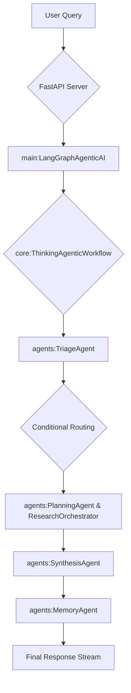

# 🤖 LangGraph Agentic AI Backend

A sophisticated multi-agent AI system built on LangGraph that orchestrates specialized agents to provide intelligent, context-aware responses through advanced reasoning and knowledge retrieval capabilities.

## 🌟 Overview

This backend implements a state-of-the-art agentic AI architecture where multiple specialized agents collaborate through a carefully orchestrated workflow. Each agent has a specific role in the cognitive pipeline, from initial query triage to complex research orchestration and response synthesis.

The system is designed to handle complex queries that require:
- **Multi-step reasoning** and research planning
- **Context-aware retrieval** from a knowledge graph and vector stores
- **Mathematical calculations** and formula extraction
- **Conversation memory** and contextual follow-ups via Redis
- **Parallel research execution** for efficiency
- **High-performance caching** for instant responses to repeated queries

## 🏗️ System Architecture

### Core Components
1.  **FastAPI Server (`server.py`)**: Exposes the agentic workflow via a streaming API.
2.  **LangGraph Workflow Engine (`core/thinking_workflow.py`)**: Manages the state and directs the flow of data between agents.
3.  **Specialized Agents (`agents/`)**: Individual Python classes that perform cognitive work (e.g., `TriageAgent`, `PlanningAgent`, `ResearchOrchestrator`).
4.  **Knowledge Infrastructure**: A Neo4j graph database for structured knowledge and Redis for caching and session management.
5.  **Cognitive Flow Logging (`core/cognitive_flow.py`)**: A real-time logging system that streams the "thinking" process of the agents to the frontend.

### High-Level Flow


## 🚀 Features

### Advanced Capabilities
- **🔄 Stateful Conversations**: Maintains context across multiple interactions using a Redis-backed `ConversationManager`.
- **🧮 Mathematical Processing**: The `EquationDetector` tool and specialized prompts enable the system to extract and understand mathematical content.
- **📊 Parallel Research**: The `ResearchOrchestrator` can execute multiple research queries simultaneously for better performance.
- **🎯 Precision Retrieval**: The `RetrievalStrategyAgent` dynamically chooses the best retrieval method (vector, keyword, or direct graph lookup) for each query.
- **🔍 Transparent Reasoning**: The `CognitiveFlowAgentWrapper` provides real-time "thinking" messages that are streamed to the client.
- **⚡ Stream Processing**: The FastAPI server uses `StreamingResponse` to send Server-Sent Events (SSE) for a real-time user experience.

## 📦 Installation

### Prerequisites
- Python 3.11+
- Poetry for dependency management
- Redis server
- Neo4j database
- API keys for: Google Gemini, Cohere, Tavily

### Setup
1.  **Clone the repository**
    ```bash
    git clone <repository-url>
    cd <repository-directory>
    ```

2.  **Install dependencies**
    ```bash
    poetry install
    ```

3.  **Configure environment**
    Create a `.env` file in the project root and add the necessary API keys and service URIs. See `config.py` for all required variables.
    ```env
    GOOGLE_API_KEY="your_google_api_key"
    COHERE_API_KEY="your_cohere_api_key"
    TAVILY_API_KEY="your_tavily_api_key"
    
    NEO4J_URI="bolt://localhost:7687"
    NEO4J_USERNAME="neo4j"
    NEO4J_PASSWORD="your_password"
    
    REDIS_URL="redis://localhost:6379"
    
    # Optional: For LangSmith Tracing
    LANGCHAIN_TRACING_V2="true"
    LANGCHAIN_API_KEY="your_langsmith_key"
    LANGCHAIN_PROJECT="your-project-name"
    ```

4.  **Initialize the database**
    The `manage_neo4j_indexes.py` script can be run to set up the necessary indexes in your Neo4j database.
    ```bash
    python manage_neo4j_indexes.py
    ```

5.  **Run the server**
    ```bash
    poetry run uvicorn server:app --reload
    ```

## 📡 API Usage

The primary way to interact with the system is through the `/query` endpoint, which provides a streaming response.

### Streaming Query
Send a `POST` request to `/query`:
```bash
curl -X POST http://localhost:8000/query \
  -H "Content-Type: application/json" \
  -d '{
    "user_query": "What are the load requirements for residential buildings?",
    "thread_id": "unique-conversation-id-123"
  }'
```

The server responds with a `text/event-stream`. You can listen for two types of events:
- **`log`**: Contains real-time "thinking" messages from the `CognitiveFlowLogger`.
- **`result`**: Contains the final answer from the `SynthesisAgent`.

**Example Frontend Logic**:
```javascript
const eventSource = new EventSource("http://localhost:8000/query", { withCredentials: true });

eventSource.addEventListener('log', (event) => {
  const logData = JSON.parse(event.data);
  console.log('Log:', logData.message);
  // Update UI with thinking messages
});

eventSource.addEventListener('result', (event) => {
  const resultData = JSON.parse(event.data);
  console.log('Final Answer:', resultData.result);
  // Display final answer
  eventSource.close();
});

eventSource.onerror = (err) => {
  console.error("EventSource failed:", err);
  eventSource.close();
};
```

## 🧪 Testing

The repository includes a test suite to validate the end-to-end functionality of the agentic workflow.

**Run the test suite**:
```bash
python comprehensive_test_suite.py
```
This script reads a series of test queries from a JSON file, runs them through the `LangGraphAgenticAI` system, and saves the results, including a full trace of the `AgentState`.

## 🗂️ Project Structure

```
.
├── agents/              # Specialized agent implementations
├── core/                # Core workflow, state, and conversation management
├── tools/               # Reusable tools (search, retrieval, etc.)
├── thinking_agents/     # Agents focused on reasoning and validation
├── knowledge_graph/     # Graph database integration logic
├── data/                # Data files, e.g. for testing
├── server.py            # FastAPI application and endpoints
├── main.py              # Main class and CLI entry point
├── config.py            # Centralized configuration management
└── prompts.py           # Centralized prompt templates for all agents
```

## 🤝 Contributing

Contributions are welcome. Please fork the repository and submit a pull request with your changes.

