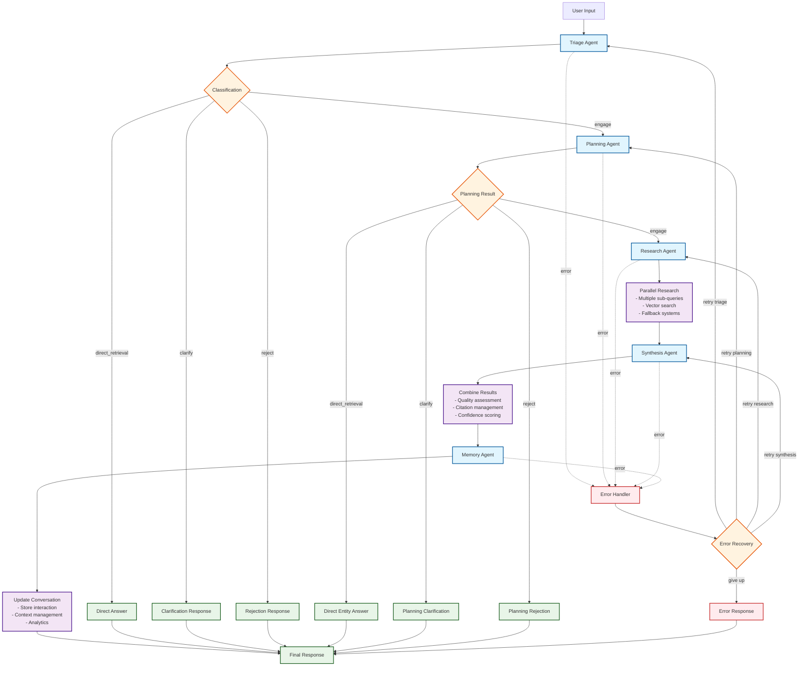
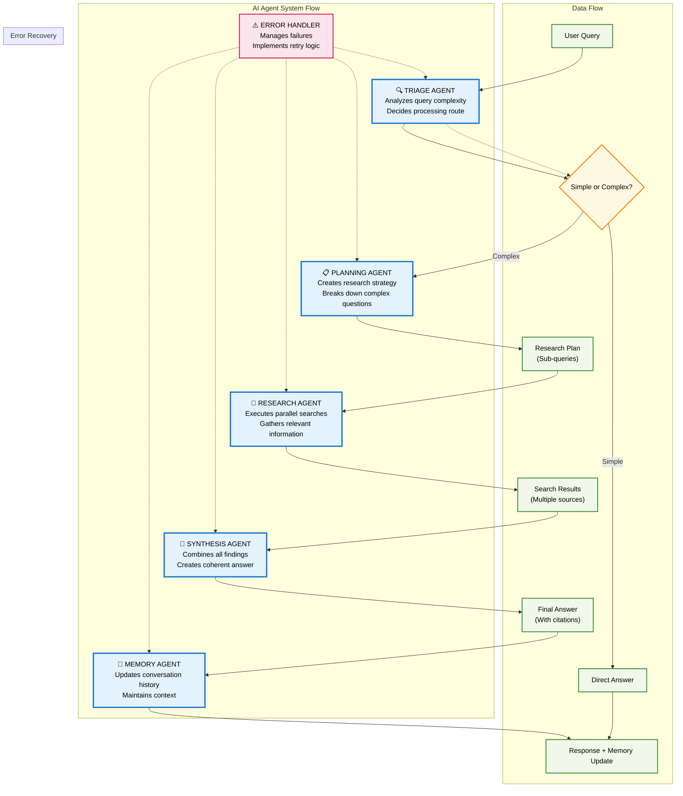

# LangGraph Agentic AI System

A sophisticated multi-agent AI system built with LangGraph for answering questions about the Virginia Building Code. This implementation preserves all the advanced features from the original ReAct-based system while leveraging LangGraph's powerful workflow orchestration capabilities.

## 🚀 Features

### Core Capabilities
- **Sophisticated Query Classification**: Intelligent triage system that routes queries appropriately
- **Advanced Planning**: Multi-strategy query decomposition with HyDE document generation  
- **Parallel Research Execution**: Concurrent processing of multiple sub-queries with fallback systems
- **Semantic Reranking**: Cross-encoder models for relevance optimization
- **Intelligent Synthesis**: Comprehensive answer generation with quality metrics
- **Error Recovery**: Sophisticated error handling with retry logic and graceful degradation
- **Memory Management**: Conversation persistence and context management

### Advanced Features
- **Multi-Tier Fallback Systems**: Vector → Graph → Keyword → Web search chains
- **Mathematical Content Processing**: Enhanced equation detection and formatting
- **Table Enhancement**: Advanced formatting for tabulated data
- **Quality Metrics**: Comprehensive confidence scoring and execution analytics
- **Debug Mode**: Detailed execution logging and intermediate output tracking

## 🏗️ Architecture

### System Overview
```
┌─────────────┐
│   TRIAGE    │ ──── Classify query type and complexity
└─────────────┘
       │
       ▼
┌─────────────┐
│  PLANNING   │ ──── Generate research plan or direct answer
└─────────────┘
       │
       ▼
┌─────────────┐
│  RESEARCH   │ ──── Execute parallel research with fallbacks
└─────────────┘
       │
       ▼
┌─────────────┐
│ SYNTHESIS   │ ──── Combine results into final answer
└─────────────┘
       │
       ▼
┌─────────────┐
│   MEMORY    │ ──── Update conversation and memory
└─────────────┘
       │
       ▼
┌─────────────┐
│   FINISH    │ ──── Return final response
└─────────────┘
```

### Detailed Workflow Flow

#### Complete System Decision Tree


#### Conceptual Agent Flow


### Agent Types

1. **TriageAgent**: Fast query classification and routing
2. **PlanningAgent**: Sophisticated query analysis and research planning
3. **ResearchOrchestrator**: Parallel research execution with advanced fallbacks
4. **SynthesisAgent**: Intelligent answer generation and quality assessment
5. **MemoryAgent**: Conversation management and persistence
6. **ErrorHandler**: Comprehensive error recovery and graceful degradation

## 🛠️ Installation & Setup

### Prerequisites
- Python 3.8+
- All dependencies from the original system
- LangGraph and related packages

### Installation
```bash
# Install additional LangGraph dependencies
pip install langgraph langchain-core

# The system uses the same configuration as the original
# Ensure your .env file is properly configured
```

### Configuration
The system uses the same configuration system as the original:
- `config.py` for model settings
- `.env` for API keys and secrets
- Same Neo4j database and vector store setup

## 🚀 Usage

### Backend Server Usage (FastAPI)

This project can be run as a backend server using FastAPI, providing a streaming API for real-time interaction.

1.  **Install Dependencies:**
    It is recommended to use a virtual environment.

    ```bash
    # Create and activate a virtual environment (optional but recommended)
    python -m venv venv
    source venv/bin/activate  # On Windows, use `venv\Scripts\activate`

    # Install all required packages
    pip install -r requirements.txt
    ```

2.  **Run the Server:**
    Launch the server using Uvicorn.

    ```bash
    uvicorn server:app --reload
    ```

3.  **Access the API:**
    The API will be available at `http://127.0.0.1:8000`.
    Interactive API documentation (provided by Swagger UI) can be accessed at `http://127.0.0.1:8000/docs`.

### Command Line Interface

#### Interactive Mode
```bash
python langgraph_agentic_ai/main.py --interactive
```

#### Single Query
```bash
python langgraph_agentic_ai/main.py --query "What are the requirements for residential stairs?"
```

#### Debug Mode
```bash
python langgraph_agentic_ai/main.py --query "Calculate wind load" --debug
```

### Programmatic Usage

#### Simple Query
```python
from langgraph_agentic_ai.main import ask_langgraph_ai

response = await ask_langgraph_ai("What is Section 1605.3.1?")
print(response)
```

#### Full Workflow Control
```python
from langgraph_agentic_ai.workflow import create_agentic_workflow
from conversation_manager import ConversationManager

# Initialize components
workflow = create_agentic_workflow(debug=False)
conversation_manager = ConversationManager()

# Run workflow
result = await workflow.run(
    user_query="Your question here",
    context_payload=conversation_manager.get_contextual_payload(),
    conversation_manager=conversation_manager
)

print(result["response"])
```

#### Integration with Original System
```python
from langgraph_agentic_ai.main import langgraph_compatibility_wrapper

# Drop-in replacement for original system
response = await langgraph_compatibility_wrapper(
    user_query="Your question",
    context_payload="Context from conversation manager"
)
```

## 🔧 Configuration Options

### Reranker Configuration
Control whether to use semantic reranking for search results:

```bash
# In .env file
USE_RERANKER=False  # Default: disabled for better performance
```

- **`USE_RERANKER=True`**: Enables semantic reranking with Cohere API
- **`USE_RERANKER=False`**: Disables reranking for faster processing

See [RERANKER_CONFIGURATION.md](RERANKER_CONFIGURATION.md) for detailed documentation.

### Debug Features
- **Execution Logging**: Detailed agent execution tracking
- **Intermediate Outputs**: Step-by-step state inspection
- **Performance Metrics**: Timing and quality analytics
- **Error Analysis**: Comprehensive error reporting

### Workflow Customization
```python
# Create custom workflow
workflow = AgenticWorkflow(
    debug_mode=True         # Enable debug logging
)

# Access individual agents
planning_agent = workflow.planning_agent
research_agent = workflow.research_agent
```

## 📊 Quality Metrics

The system provides comprehensive quality tracking:

```python
result = await workflow.run(user_query="Your question")

summary = result["execution_summary"]
print(f"Confidence Score: {summary['confidence_score']}")
print(f"Execution Time: {summary['total_execution_time_ms']}ms")
print(f"Agents Used: {summary['workflow_path']}")
print(f"Quality Metrics: {summary['quality_metrics']}")
```

## 🔄 Migration from Original System

### Advantages of LangGraph Version
1. **Better Observability**: Visual workflow tracking and execution logs
2. **Enhanced Error Handling**: Sophisticated retry and recovery mechanisms  
3. **Improved Scalability**: Better resource management and parallel execution
4. **Flexible Routing**: Dynamic workflow paths based on query characteristics
5. **Memory Persistence**: Built-in conversation state management
6. **Debug Capabilities**: Comprehensive development and troubleshooting tools

### Preserved Features
- ✅ All original tool logic (Planning, Research, Synthesis)
- ✅ Same Neo4j queries and database operations
- ✅ Identical reranking and web search capabilities
- ✅ Original conversation manager integration
- ✅ Same configuration system and API keys
- ✅ Parallel research processing
- ✅ Multi-tier fallback systems

### Performance Comparison
- **Reliability**: Enhanced error recovery improves system stability
- **Observability**: Much better debugging and monitoring capabilities
- **Maintainability**: Cleaner separation of concerns and agent responsibilities
- **Extensibility**: Easy to add new agents or modify workflow logic

## 🛡️ Error Handling

The system includes sophisticated error handling:

### Recovery Strategies
- **Retry Logic**: Automatic retry for transient failures
- **Fallback Plans**: Alternative execution paths for failed agents
- **Graceful Degradation**: Helpful error messages for unrecoverable failures
- **Error Classification**: Intelligent analysis of error types and severity

### Error Types Handled
- Network timeouts and connectivity issues
- Rate limiting and API quota exceeded
- Authentication and configuration errors
- Missing resources and data validation
- Agent execution failures

## 📈 Monitoring & Analytics

### Execution Tracking
```python
# Access detailed execution information
workflow_state = result["workflow_state"]
execution_log = workflow_state["execution_log"]

for entry in execution_log:
    print(f"Agent: {entry['agent_name']}")
    print(f"Time: {entry['execution_time_ms']}ms")
    print(f"Success: {entry['success']}")
```

### Performance Insights
```python
# Get performance analytics (Enhanced mode)
if "conversation_analytics" in result:
    analytics = result["conversation_analytics"]
    print(f"Query Complexity: {analytics['query_complexity']}")
    print(f"Response Quality: {analytics['response_quality']}")
    print(f"Resource Utilization: {analytics['resource_utilization']}")
```

## 🤝 Contributing

This implementation maintains full compatibility with the original system while adding LangGraph's capabilities. When contributing:

1. Preserve all original tool logic
2. Maintain the same configuration system
3. Ensure backward compatibility
4. Add comprehensive tests for new features
5. Document any changes to the workflow

## 📝 License

Same license as the original system.

## 🆘 Support

For issues specific to the LangGraph implementation, please provide:
- Query being processed
- Debug mode output (`--debug` flag)
- Execution summary from the workflow
- Any error messages from the logs 