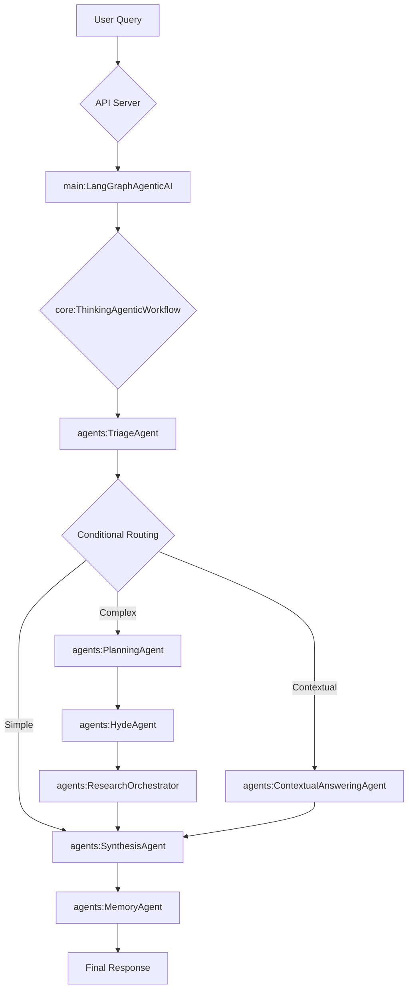

# Technical Architecture & Agent Specifications

This document provides an in-depth technical analysis of the LangGraph-based multi-agent AI system architecture, detailing the design decisions, agent behaviors, and system workflows.

## Table of Contents

1. [System Architecture Overview](#system-architecture-overview)
2. [Core Design Principles](#core-design-principles)
3. [State Management (`core/state.py`)](#state-management-corestatepy)
4. [Workflow Orchestration (`core/thinking_workflow.py`)](#workflow-orchestration-corethinking_workflowpy)
5. [Agent Specifications (`agents/`)](#agent-specifications-agents)
6. [Data Infrastructure](#data-infrastructure)

## System Architecture Overview

The system implements a **Directed Acyclic Graph (DAG)** workflow using LangGraph, where specialized agents process information through a stateful pipeline. Each agent is a Python class designed with a single responsibility, enabling modularity and clear separation of concerns.

### High-Level Flow


## Core Design Principles
- **Stateful & Asynchronous**: The workflow is built around a shared state object (`AgentState`) and leverages `asyncio` for non-blocking I/O.
- **Modularity**: Agents and Tools are self-contained and have specific roles.
- **Fail-Safety**: An `ErrorHandler` agent manages retries and graceful degradation.
- **Observability**: A `CognitiveFlowAgentWrapper` provides real-time "thinking" logs for each step.
- **Configuration-Driven**: Key behaviors (like parallel execution or model selection) are controlled via `config.py`.

## State Management (`core/state.py`)

The `AgentState` is a `TypedDict` that acts as the central data object passed between all agents.

### Key State Fields
This is a small subset of the ~40 keys in the `AgentState`.
```python
class AgentState(TypedDict):
    # Core Inputs
    user_query: str
    context_payload: str
    
    # Workflow Control
    current_step: Literal["triage", "planning", "research", ...]
    workflow_status: Literal["running", "completed", "failed", "retry"]
    
    # Agent Outputs
    triage_classification: Optional[Literal["engage", "direct_retrieval", ...]]
    research_plan: Optional[List[Dict[str, str]]]
    sub_query_answers: Optional[List[Dict[str, str]]]
    final_answer: Optional[str]

    # Error Handling & Logging
    error_state: Optional[Dict[str, Any]]
    execution_log: List[ExecutionLog] # A log of each agent's execution
```

## Workflow Orchestration (`core/thinking_workflow.py`)

The `ThinkingAgenticWorkflow` class builds the `langgraph.StateGraph`.

### Graph Construction
```python
class ThinkingAgenticWorkflow:
    def _build_workflow_graph(self) -> StateGraph:
        workflow = StateGraph(AgentState)
        
        # Nodes are agents wrapped for cognitive logging
        workflow.add_node(
            "triage", 
            CognitiveFlowAgentWrapper(TriageAgent(), self.cognitive_flow_logger)
        )
        # ... other agents
        
        workflow.set_entry_point("triage")
        
        # Conditional edges define the workflow logic
        workflow.add_conditional_edges(
            "triage",
            self._route_after_triage,
            {
                "planning": "planning",
                "research": "research",
                "contextual_answering": "contextual_answering",
                "finish": END,
                "error": "error_handler"
            }
        )
        return workflow
```

### Routing Logic
The routing functions are the core of the workflow's intelligence. They inspect the `AgentState` to decide which node to execute next.

```python
def _route_after_triage(self, state: AgentState) -> Literal["planning", ...]:
    """Route after triage based on the classification."""
    if state.get("error_state"):
        return "error"
    classification = state.get("triage_classification")
    if classification == "simple_response": 
        return "finish"
    if classification == "contextual_clarification": 
        return "contextual_answering"
    if classification == "direct_retrieval": 
        return "research"
    return "planning"
```

## Agent Specifications (`agents/`)

Each agent inherits from `BaseLangGraphAgent` and implements the `async def execute(self, state: AgentState) -> Dict[str, Any]` method.

- **`TriageAgent`**: Classifies the query and checks a Redis cache.
- **`PlanningAgent`**: Uses `PlanningTool` to create a `research_plan`.
- **`HydeAgent`**: Uses `HydeTool` to generate hypothetical documents for the plan.
- **`ResearchOrchestrator`**: Executes the research plan, using `RetrievalStrategyAgent` to pick the best tool (`vector_search`, `keyword_retrieval`, etc.) for each step.
- **`SynthesisAgent`**: Uses `SynthesisTool` to combine research results into the `final_answer`.
- **`MemoryAgent`**: Interacts with `ConversationManager` to persist the final state.
- **`ErrorHandler`**: Manages the `error_state` and determines if a retry is possible.

## Data Infrastructure

### Neo4j Knowledge Graph (`tools/neo4j_connector.py`)
- **Schema**: The graph structure is implied by the Cypher queries in `neo4j_connector.py` and `direct_retrieval_queries.py`. It includes nodes like `Chapter`, `Section`, `Subsection`, `Passage`, `Table`, `Diagram`, and `Math`. Relationships like `:CONTAINS` and `:HAS_CHUNK` define the hierarchy.
- **Indexes**: The code creates and uses a vector index (`passage_embedding_index`) and full-text indexes (`passage_content_idx`, `knowledge_base_text_idx`).

### Redis Caching & Memory (`core/conversation_manager.py`)
- **Query Cache**: The `TriageAgent` checks for previously answered questions stored in Redis under keys like `query_cache:<hash>`. The `SynthesisAgent` populates this cache.
- **Session Memory**: The `ConversationManager` stores the conversation history and structured memory for each `conversation_id`, primarily in Redis with a file-based backup. This allows the system to have long-term memory across multiple interactions.

